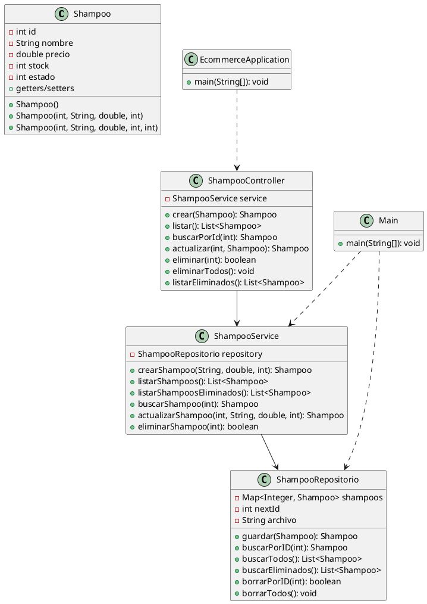

# Ejemplo de eCommerce

## Descripción
Este proyecto es un ejemplo básico de una aplicación de comercio electrónico (eCommerce) desarrollada en Java y Spring Boot. Permite la gestión de productos (shampoos) con operaciones CRUD, persistencia en archivo y una API REST.

## Autor
- Evelina Caparrós

## Estructura del proyecto
- `src/main/java/org/example/`: Código fuente principal
    - `Shampoo.java`: Clase modelo de producto
    - `ShampooRepositorio.java`: Acceso a datos y persistencia
    - `ShampooService.java`: Lógica de negocio
    - `ShampooController.java`: API REST
    - `EcommerceApplication.java`: Clase principal Spring Boot
    - `Main.java`: Interfaz de usuario por consola (CLI)
- `lista de shampoos`: Archivo de persistencia de productos

## Propiedades de un Shampoo
Cada shampoo tiene las siguientes propiedades:
- `id` (int): Identificador único del producto.
- `nombre` (String): Nombre del shampoo.
- `precio` (double): Precio unitario.
- `stock` (int): Cantidad disponible en stock.
- `estado` (int): Estado lógico del producto:
    - `1`: habilitado (activo, visible en listados principales)
    - `0`: deshabilitado (eliminado lógicamente, solo visible en listados de eliminados)

Al listar, solo se muestran los shampoos habilitados (`estado = 1`). Los eliminados pueden consultarse aparte mediante el endpoint correspondiente.

## Consideraciones para el Frontend
- Validar que no se creen shampoos con nombres repetidos.
- Mostrar mensajes claros ante datos inválidos o duplicados.
- Sincronizar la lista con el backend tras crear, editar o eliminar.
- Controlar que los campos obligatorios estén completos y sean válidos.
- Manejar errores del backend mostrando mensajes amigables.
- Evitar envíos múltiples deshabilitando el botón de guardar durante la petición.
- Filtrar y no mostrar shampoos con estado eliminado (`estado = 0`).

## Datos de prueba sugeridos
```
1,Head & Shoulders,200.0,20,1
2,Sedal,50.0,0,1
3,Pantene,120.5,100,0
4,Clear Men,80.0,5,1
5,Herbal Essences,300.0,999999,1
6,Shampoo Económico,10.0,1,1
7,Shampoo Premium,999.99,2,1
8,Shampoo Eliminado,25.0,50,0
9,Repetido,44.0,987654321,1
10,Repetido,44.0,987654321,1
11,Sin Stock,15.0,0,1
12,Ultra Barato,1.0,1000,1
13,Ultra Caro,10000.0,3,1
14,Nombre Largo de Prueba para Shampoo,55.5,10,1
15,ShampooConCaracteresEspeciales@#%!,60.0,7,1
```
- Incluye nombres únicos, precios extremos, stock en cero, productos eliminados y repetidos, nombres largos y caracteres especiales.

## Cómo iniciar la aplicación

### Opción 1: Interfaz por consola (Java puro)
1. Compila el proyecto:
   ```sh
   mvn clean install
   ```
2. Ejecuta la aplicación por consola:
   ```sh
   java -cp target/eCommerce_Ejercicio-1.0-SNAPSHOT.jar org.example.Main
   ```

### Opción 2: API REST con Spring Boot
1. Instala las dependencias:
   ```sh
   mvn clean install
   ```
2. Inicia la aplicación Spring Boot:
   ```sh
   mvn spring-boot:run
   ```
3. La API estará disponible en: [http://localhost:8080/api/shampoos](http://localhost:8080/api/shampoos)

## Cómo correr los tests unitarios
Para ejecutar los tests unitarios del proyecto, usa el siguiente comando:
```sh
mvn test
```
Esto ejecutará todos los tests definidos en la carpeta `src/test/java` y mostrará un resumen de los resultados en la consola.

## Endpoints y ejemplos curl
### 1. Crear shampoo
```sh
curl -X POST http://localhost:8080/api/shampoos -H "Content-Type: application/json" -d '{"nombre":"Head & Shoulders","precio":123.45,"stock":10}'
```
### 2. Listar shampoos habilitados
```sh
curl http://localhost:8080/api/shampoos
```
### 3. Buscar shampoo por ID
```sh
curl http://localhost:8080/api/shampoos/1
```
### 4. Actualizar shampoo
```sh
curl -X PUT http://localhost:8080/api/shampoos/1 -H "Content-Type: application/json" -d '{"nombre":"Nuevo Nombre","precio":200.0,"stock":20}'
```
### 5. Eliminar shampoo (lógico)
```sh
curl -X DELETE http://localhost:8080/api/shampoos/1
```
### 6. Eliminar todos los shampoos (lógico)
```sh
curl -X DELETE http://localhost:8080/api/shampoos
```
### 7. Listar shampoos eliminados
```sh
curl http://localhost:8080/api/shampoos/eliminados
```

## Diagrama UML
Puedes generar el diagrama actualizado de clases con PlantUML:
1. Ve a: https://www.plantuml.com/plantuml
2. Pega el siguiente texto en el editor:

Esto generará un diagrama de clases actualizado con las relaciones y atributos principales del sistema.

## Supuestos y limitaciones del sistema

- El stock se maneja solo como cantidad de unidades (no por cajas ni otros formatos).
- El precio se maneja en una única moneda (por defecto, pesos argentinos o la moneda local del usuario; no hay conversión ni símbolo).
- No hay control de usuarios ni autenticación: cualquier usuario puede operar sobre los datos.
- No se valida la unicidad del nombre de shampoo en el backend (se recomienda hacerlo en el frontend).
- El campo `estado` solo permite dos valores: `1` (habilitado) y `0` (eliminado lógicamente).
- No hay control de fechas de alta, baja ni modificación.
- No se maneja historial de cambios ni auditoría.
- El archivo `lista de shampoos` es la única fuente de persistencia (no hay base de datos relacional-por ahora-).
- No se contemplan impuestos, descuentos ni promociones.
- No hay validación de formato para caracteres especiales en el nombre.

