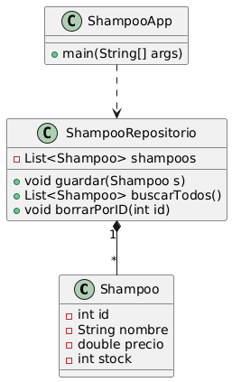

# Ejemplo de eCommerce

## Descripción
Este proyecto es un ejemplo básico de una aplicación de comercio electrónico (eCommerce) desarrollada en Java y Spring Boot. Permite la gestión de productos (shampoos) con operaciones CRUD, persistencia en archivo y una API REST.

## Detalles del desarrollo
- Lenguaje: Java
- Framework: Spring Boot
- Herramientas: Maven, JUnit

### Estructura del proyecto
- `src/main/java/org/example/`: Código fuente principal
    - `Shampoo.java`: Clase modelo de producto
    - `ShampooRepositorio.java`: Acceso a datos y persistencia
    - `ShampooService.java`: Lógica de negocio
    - `ShampooController.java`: API REST
    - `EcommerceApplication.java`: Clase principal Spring Boot
- `lista de shampoos`: Archivo de persistencia de productos

## Estado del Shampoo
- Cada shampoo tiene un campo `estado`:
    - `1`: habilitado (activo)
    - `0`: deshabilitado (eliminado lógicamente)
- Al listar, solo se muestran los habilitados. Los eliminados pueden consultarse aparte.

## Cómo iniciar la aplicación Spring Boot
1. Instala las dependencias:
   ```sh
   mvn clean install
   ```
2. Inicia la aplicación:
   ```sh
   mvn spring-boot:run
   ```
3. La API estará disponible en: [http://localhost:8080/api/shampoos](http://localhost:8080/api/shampoos)

## Endpoints y ejemplos curl

### 1. Crear shampoo
```sh
curl -X POST http://localhost:8080/api/shampoos -H "Content-Type: application/json" -d '{"nombre":"Head & Shoulders","precio":123.45,"stock":10}'
```

### 2. Listar shampoos habilitados
```sh
curl http://localhost:8080/api/shampoos
```

### 3. Buscar shampoo por ID
```sh
curl http://localhost:8080/api/shampoos/1
```

### 4. Actualizar shampoo
```sh
curl -X PUT http://localhost:8080/api/shampoos/1 -H "Content-Type: application/json" -d '{"nombre":"Nuevo Nombre","precio":200.0,"stock":20}'
```

### 5. Eliminar shampoo (lógico)
```sh
curl -X DELETE http://localhost:8080/api/shampoos/1
```

### 6. Eliminar todos los shampoos (lógico)
```sh
curl -X DELETE http://localhost:8080/api/shampoos
```

### 7. Listar shampoos eliminados
```sh
curl http://localhost:8080/api/shampoos/eliminados
```

## Diagrama:



## Autor
- Evelina Caparrós
